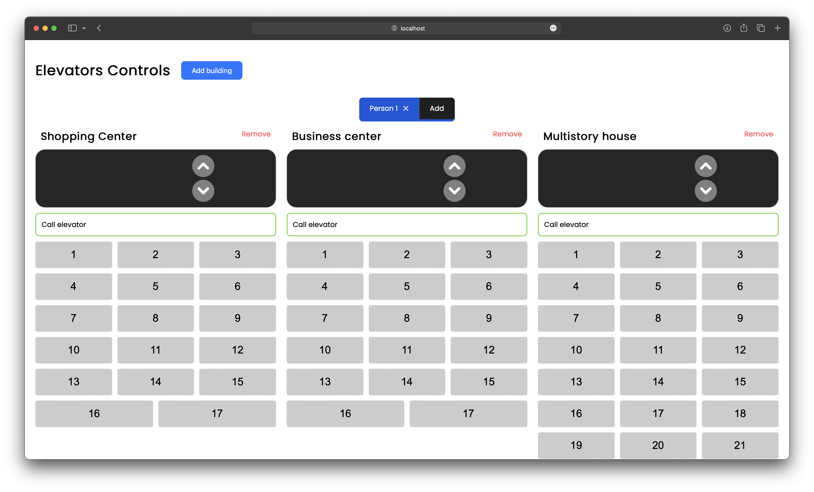

# Elevator App

Welcome to the Elevator App! This application simulates an elevator system where you can add/remove persons, switch between them, add/remove buildings with a dynamic count of floors and elevators, and call elevators from different persons.

## Description

The Elevator App is designed to showcase an elevator system implementation using React. It allows users to interact with multiple persons, buildings, and elevators and observe their movement within the system.

## Features

-   Add/remove persons to simulate multiple individuals using the elevators.
-   Switch between different persons to observe their respective interactions with the elevator system.
-   Add/remove buildings with a customizable number of floors and elevators.
-   Call elevators from different persons to move between floors within the buildings.

## Usage

1. Install npm packages: `npm install`
2. Start the development server: `npm run dev`
3. Open your browser and visit: `http://localhost:5173`

## Testing

1. Run test: `npm run test`
2. Run linter test `npm run lint`

